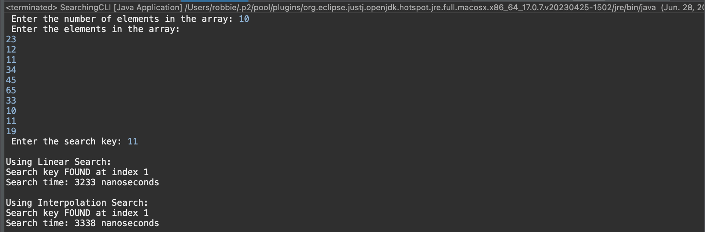
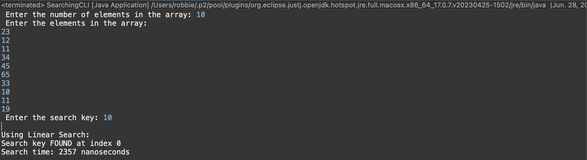

# ENSF694 Lab 2 Report
Author: Robert Mason

## Question 1

Sample Input Test Screenshot:

note: the input elements were sorted prior to running both algorithms.

## Question 2

The linear search algorithm had a slightly faster running time than the interpolation algorithm for the sample input. This result was not unexpected since the linear searching algorithm is most efficient on small amounts of data like the sample input. Interpolation/Binary algorithms would be expected to outperform the linear search algorithm on a large data set. 

## Question 3
For the sample input, the key was found at index 1 which would have resulted in 2 iterations of the linear search algorithm.  If the key value is located at index 0, only a single iteration will be required which should reduce the running time.  This was proven correct as seen in the image below where the running time was reduced by 27% as compared to the example shown above.

